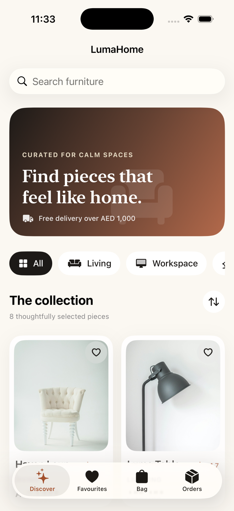
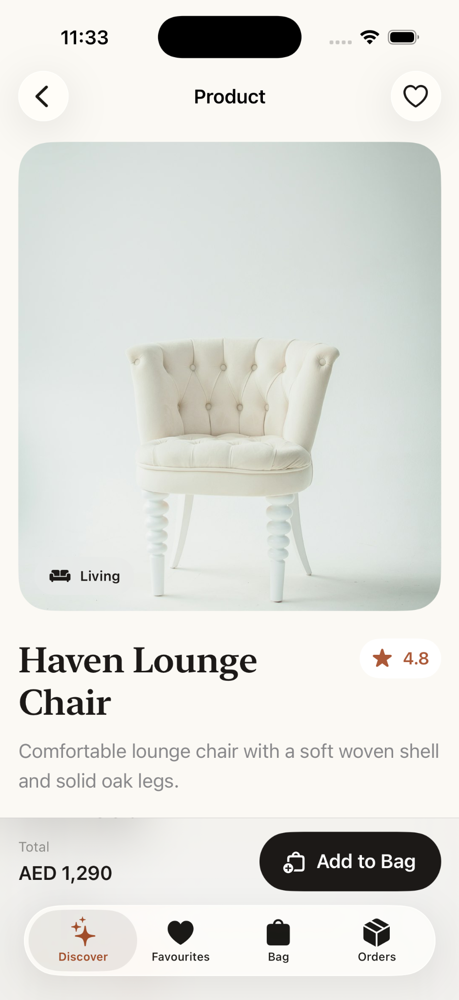
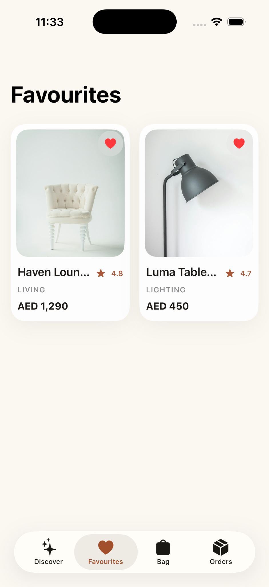
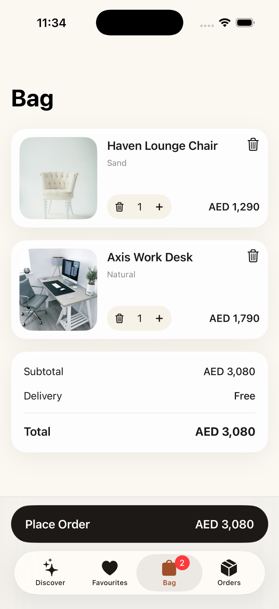
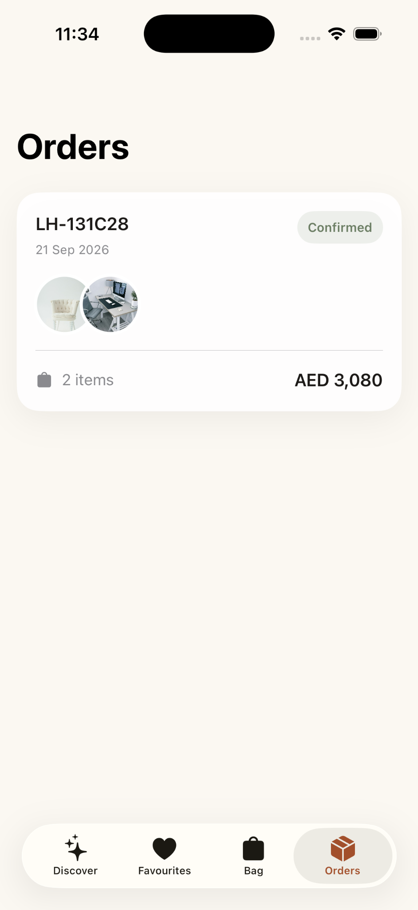

# LumaHome

### Native iOS Furniture Commerce Experience

LumaHome is a polished **SwiftUI** portfolio application that takes a curated furniture catalogue through a complete shopping journey: discovery, search, filtering, favourites, product configuration, a persistent bag, local checkout, and order history.

The project focuses on product-quality iOS UI engineering rather than pretending to be a production commerce backend. Catalogue data ships with the app, user state persists locally, and the architecture keeps product, favourites, bag, and order responsibilities separated so remote services can be introduced later.

## Preview

<p align="center">
  
  
  
</p>

<p align="center">
  
  
</p>

> Screenshots were captured from an iPhone 17 Pro Simulator. Physical-device and App Store release validation are separate release gates.

## Product Experience

| Area | Capabilities |
|---|---|
| **Discover** | Editorial hero, search, category filtering, sort modes and responsive product grid |
| **Product Details** | Product photography, rating, finish selection, quantity and add-to-bag flow |
| **Favourites** | Save/unsave products with persistence across launches |
| **Bag** | Persistent cart, quantity editing, subtotal, delivery calculation and checkout |
| **Orders** | Local order creation, generated references, item summaries and persisted history |
| **States** | Loading, empty, retry and order-confirmation states |
| **Accessibility** | Semantic labels and accessible primary controls |

## Architecture

```text
SwiftUI Views
     ↓
View Models + Focused Services
     ↓
Local catalogue / Codable persistence
```

```text
ProductService
 └─ loads bundled catalogue

FavoritesService
 └─ persists saved product IDs

CartService
 └─ owns bag state, quantity and pricing

OrderService
 └─ creates and persists local order history
```

The views remain focused on presentation while business state lives in dedicated observable services/view models.

## Project Structure

```text
LumaHome/
├── App/
├── Components/
├── DesignSystem/
├── Features/
│   ├── Discover/
│   ├── Favorites/
│   ├── ProductDetails/
│   ├── Bag/
│   └── Orders/
├── Models/
├── Resources/
├── Services/
└── Assets.xcassets/
```

## Technology

- Swift
- SwiftUI
- MVVM-style presentation separation
- Combine / `ObservableObject`
- async/await
- `Decimal` for commerce pricing
- Codable + UserDefaults persistence
- `AsyncImage`
- `NavigationStack`
- accessibility-aware SwiftUI controls
- GitHub Actions iOS Simulator build

## Design System

LumaHome uses a warm editorial visual system inspired by natural interiors: ink, paper, terracotta, sand, and sage. Shared styling in `Theme.swift` keeps cards, typography, spacing, and surfaces consistent across the shopping journey.

The interface intentionally combines large editorial typography with restrained commerce controls so the application feels closer to a real furniture brand than a generic catalogue demo.

## Running the Project

Requirements:

- macOS
- Xcode with an iOS 17+ SDK

Open:

```bash
open LumaHome.xcodeproj
```

Select the **LumaHome** scheme and an iPhone Simulator, then run the project.

Command-line simulator build:

```bash
xcodebuild \
  -project LumaHome.xcodeproj \
  -scheme LumaHome \
  -configuration Debug \
  -sdk iphonesimulator \
  -destination 'generic/platform=iOS Simulator' \
  CODE_SIGNING_ALLOWED=NO \
  build
```

## Validation Status

The current portfolio build has been compiled and exercised successfully on an **iPhone 17 Pro Simulator**, including the primary flow:

```text
Discover
  ↓
Product Details
  ↓
Favourite / Add to Bag
  ↓
Bag
  ↓
Place Order
  ↓
Orders
```

GitHub Actions also contains an iOS Simulator build workflow for repository-level build validation after publishing.

## Engineering Decisions

- **Pricing uses `Decimal`**, avoiding floating-point values for commerce totals.
- **Persistence is separated by domain** rather than storing app state directly inside SwiftUI views.
- **Catalogue loading is service-backed**, making future API replacement straightforward.
- **Product discovery logic lives in a view model**, keeping filtering/search/sort behavior testable and reusable.
- **The design system is centralized**, reducing visual drift between screens.
- **Checkout is intentionally local and deterministic**; the project does not claim production payment processing.

## Honest Scope

LumaHome is a portfolio commerce simulation. It does **not** claim:

- a production payment gateway,
- live inventory or fulfilment services,
- customer accounts or authentication,
- a completed ARKit/RealityKit placement experience.

`supportsAR` is catalogue metadata for future AR work; AR-capable products are not presented as an implemented room-placement feature.

## Portfolio Summary

> Built a native SwiftUI furniture commerce experience with editorial discovery, search/filter/sort, persistent favourites, configurable product details, local cart pricing, checkout, and order history. Structured the app around focused services and view models, a reusable design system, accessibility-aware interactions, and simulator/CI build validation.

## Next Release Gates

- physical-device validation
- UI/snapshot test target
- signed archive and TestFlight build
- production catalogue/inventory API
- payment integration
- optional RealityKit/ARKit product placement

## License

This repository is published as a portfolio and engineering case study. No license is granted for reuse unless one is added explicitly.
